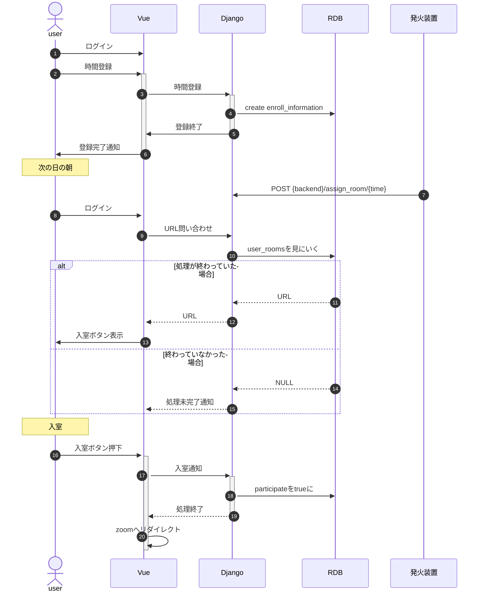
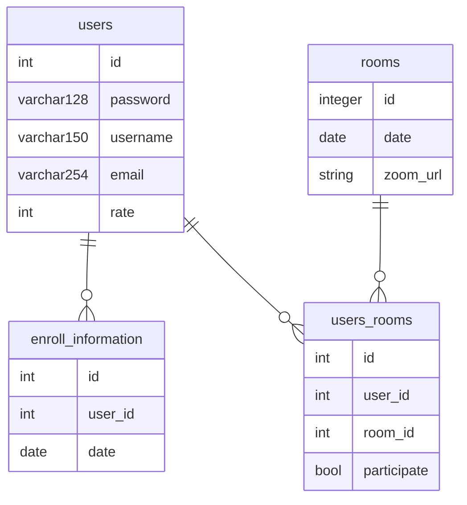

## ユーザーフロー

1. 明日くじに起きたいと思う
1. トップページを開く
1. ログインする
1. 9時を登録する-> create enroll_information
1. 明日になる
1. バッチ処理が走って割り当てとZoom APIを叩く.
    - from enroll_information where date検索
    - user_idをnグループに分ける。
    - グループごとにcreate room -> url が返ってくる
    - roomsテーブルを作る。
    - user_roomsテーブルを作る。participate=false
1. ユーザがサイトにくる。
1. ログインしてメインページへ
1. フロントがバックエンドにバッチ処理が終わっているか問い合わせる。->フロントにURLを返す。
1. フロントが終わっていたので参加ボタン表示
1. 参加する。
1. 参加をデータベースに登録
1. 

ユーザー   
フロント  
- GET バッチ処理終わってる？
バックエンド
- 
発火装置  
- 8:50になったらcurlでも POST {backend}/assign_room/{9:00}

### シーケンス

[Markdown Preview Mermaid Support](https://marketplace.visualstudio.com/items?itemName=bierner.markdown-mermaid)

## データベース

### ER図

## Django

### エンドポイント (トークン認証) Token Verification

- POST /signup
- POST /login

Authorized: トークン  

- POST /register/
    - date
- GET /meeting_url/{user_id}
- POST /paticipated
  
バッチ処理用:  

- POST /assign_room/
    - date
